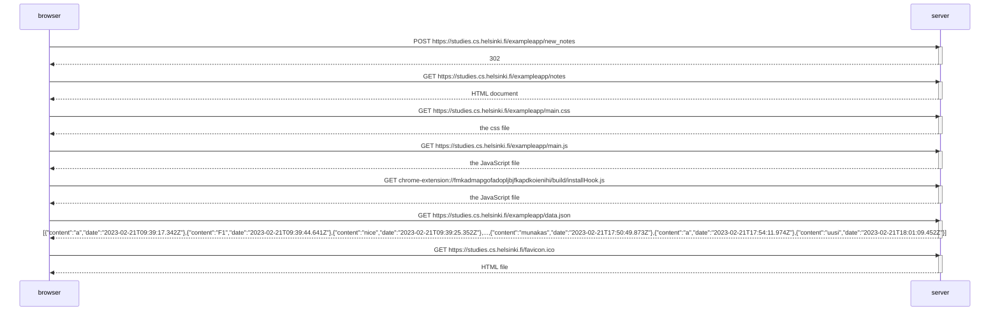
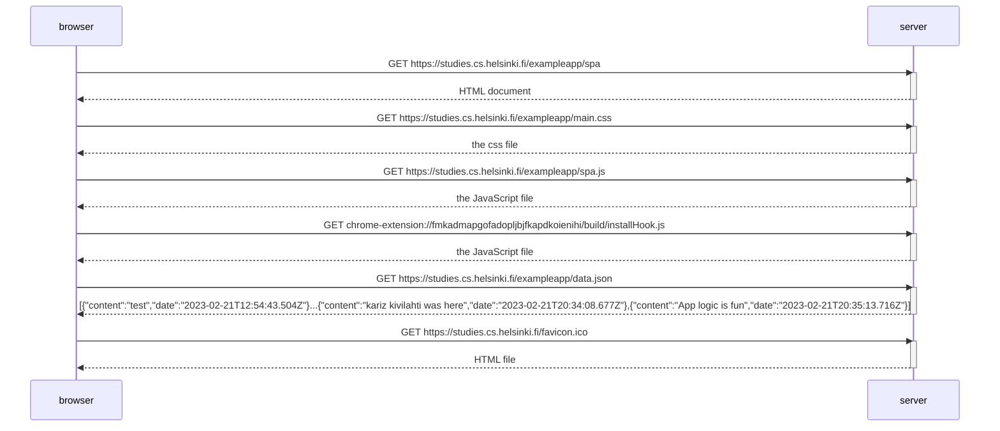
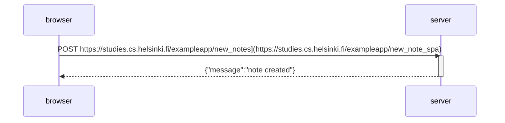

time used 18:00 - 22:51

0.4: uusi muistiinpano sequenceDiagram

```mermaid

sequenceDiagram
    participant browser
    participant server
 
    
    browser->>server: POST https://studies.cs.helsinki.fi/exampleapp/new_notes
    activate server
    server-->>browser: 302
    deactivate server

    browser->>server: GET https://studies.cs.helsinki.fi/exampleapp/notes
    activate server
    server-->>browser: HTML document
    deactivate server
	
    browser->>server: GET https://studies.cs.helsinki.fi/exampleapp/main.css
    activate server
    server-->>browser: the css file
    deactivate server

    browser->>server: GET https://studies.cs.helsinki.fi/exampleapp/main.js
    activate server
    server-->>browser: the JavaScript file
    deactivate server

    browser->>server: GET chrome-extension://fmkadmapgofadopljbjfkapdkoienihi/build/installHook.js
    activate server
    server-->>browser: the JavaScript file
    deactivate server

    browser->>server: GET https://studies.cs.helsinki.fi/exampleapp/data.json
    activate server
    server-->>browser: [{"content":"a","date":"2023-02-21T09:39:17.342Z"},{"content":"F1","date":"2023-02-21T09:39:44.641Z"},{"content":"nice","date":"2023-02-21T09:39:25.352Z"},...,{"content":"munakas","date":"2023-02-21T17:50:49.873Z"},{"content":"a","date":"2023-02-21T17:54:11.974Z"},{"content":"uusi","date":"2023-02-21T18:01:09.452Z"}]
    deactivate server

    browser->>server: GET https://studies.cs.helsinki.fi/favicon.ico
    activate server
    server-->>browser: HTML file
    deactivate server
```
0.5: Single Page App

```mermaid

sequenceDiagram
    participant browser
    participant server

    browser->>server: GET https://studies.cs.helsinki.fi/exampleapp/spa
    activate server
    server-->>browser: HTML document
    deactivate server
	
    browser->>server: GET https://studies.cs.helsinki.fi/exampleapp/main.css
    activate server
    server-->>browser: the css file
    deactivate server

    browser->>server: GET https://studies.cs.helsinki.fi/exampleapp/spa.js
    activate server
    server-->>browser: the JavaScript file
    deactivate server

    browser->>server: GET chrome-extension://fmkadmapgofadopljbjfkapdkoienihi/build/installHook.js
    activate server
    server-->>browser: the JavaScript file
    deactivate server
    
    browser->>server: GET https://studies.cs.helsinki.fi/exampleapp/data.json
    activate server
    server-->>browser: [{"content":"test","date":"2023-02-21T12:54:43.504Z"}...{"content":"kariz kivilahti was here","date":"2023-02-21T20:34:08.677Z"},{"content":"App logic is fun","date":"2023-02-21T20:35:13.716Z"}]
    deactivate server
    
     browser->>server: GET https://studies.cs.helsinki.fi/favicon.ico
    activate server
    server-->>browser: HTML file
    deactivate server
```
0.6: Uusi muistiinpano

```mermaid
sequenceDiagram
    participant browser
    participant server
 
    
    browser->>server: POST https://studies.cs.helsinki.fi/exampleapp/new_notes](https://studies.cs.helsinki.fi/exampleapp/new_note_spa)
    activate server
    server-->>browser: {"message":"note created"}
    deactivate server
```
