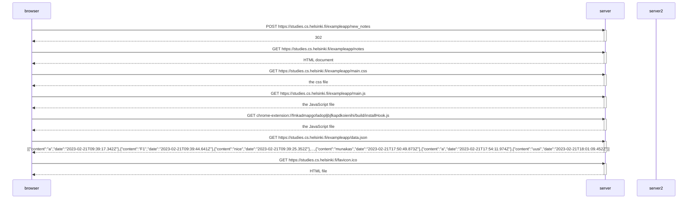

0.4: uusi muistiinpano sequenceDiagram

```mermaid

sequenceDiagram
    participant browser
    participant server
    participant server2
    
    browser->>server: POST https://studies.cs.helsinki.fi/exampleapp/new_notes
    activate server
    server-->>browser: 302
    deactivate server

    browser->>server: GET https://studies.cs.helsinki.fi/exampleapp/notes
    activate server
    server-->>browser: HTML document
    deactivate server
	
    browser->>server: GET https://studies.cs.helsinki.fi/exampleapp/main.css
    activate server
    server-->>browser: the css file
    deactivate server

    browser->>server: GET https://studies.cs.helsinki.fi/exampleapp/main.js
    activate server
    server-->>browser: the JavaScript file
    deactivate server

    browser->>server: GET chrome-extension://fmkadmapgofadopljbjfkapdkoienihi/build/installHook.js
    activate server
    server-->>browser: the JavaScript file
    deactivate server

    browser->>server: GET https://studies.cs.helsinki.fi/exampleapp/data.json
    activate server
    server-->>browser: [{"content":"a","date":"2023-02-21T09:39:17.342Z"},{"content":"F1","date":"2023-02-21T09:39:44.641Z"},{"content":"nice","date":"2023-02-21T09:39:25.352Z"},...,{"content":"munakas","date":"2023-02-21T17:50:49.873Z"},{"content":"a","date":"2023-02-21T17:54:11.974Z"},{"content":"uusi","date":"2023-02-21T18:01:09.452Z"}]
    deactivate server

    browser->>server: GET https://studies.cs.helsinki.fi/favicon.ico
    activate server
    server-->>browser: HTML file
    deactivate server
```
